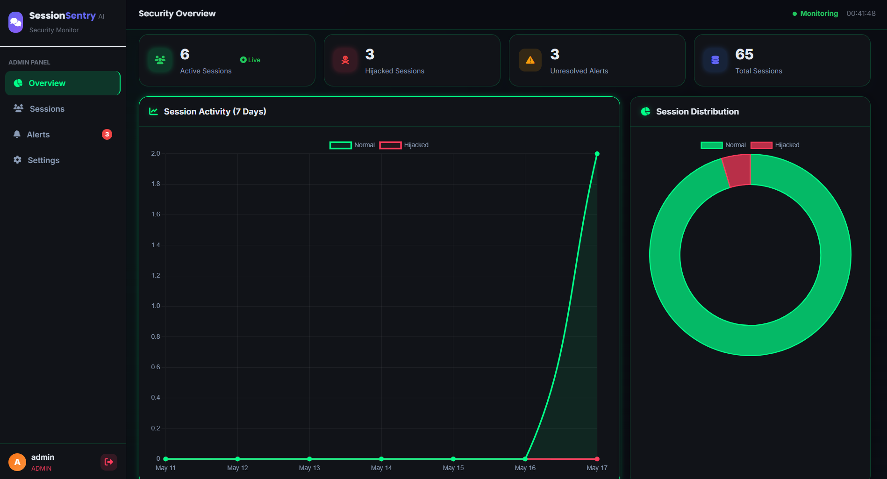
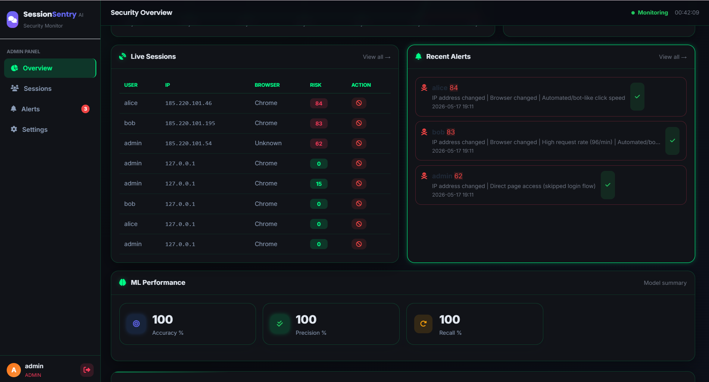
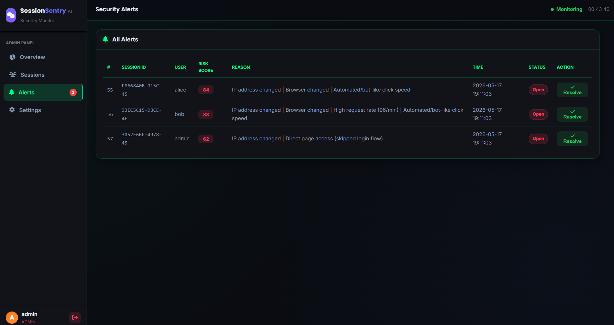
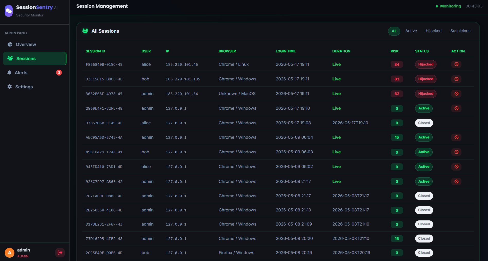
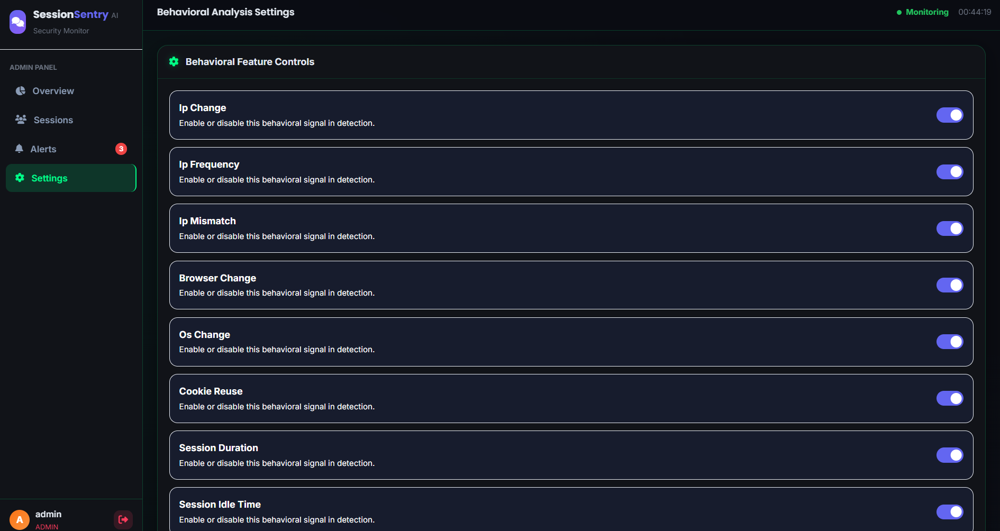
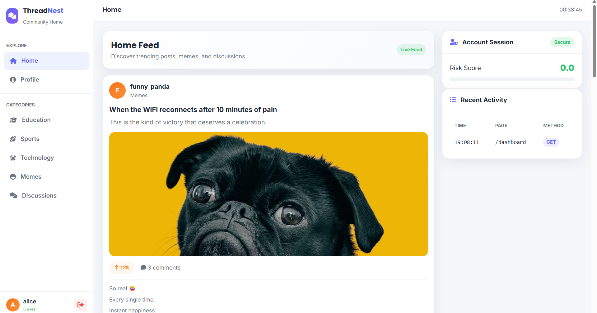

# 🛡️ SessionSentry
### AI-Based Behavioral Session Hijacking Detection Framework

SessionSentry is a complete AI-powered cybersecurity monitoring system that detects **session hijacking attacks** using behavioral analysis and Machine Learning (Random Forest).

Instead of simple IP-based rules, it monitors **19 behavioral features** in real-time and uses an ML model to classify sessions as:
- **Normal** (Risk Score 0–30)
- **Suspicious** (Risk Score 30–60)
- **Hijacked** (Risk Score 60+)


## Admin Dashboard



## Attack Detection Alerts


## Sessions


## Behavioural_Features


## 👤 Victim Dashboard



## Quick Start (Step-by-Step)

### Prerequisites
- Python 3.9+ installed
- VS Code (recommended)


### Step 1 — Open Project in VS Code

1. Extract/copy the `SessionSentry` folder somewhere on your computer
2. Open VS Code
3. Click **File → Open Folder** → select `SessionSentry`
4. Open the Terminal: press `` Ctrl+` `` (backtick)


### Step 2 — Create Virtual Environment

In the VS Code terminal, type these commands one by one:

```bash
# Create virtual environment
python -m venv venv

# Activate it (Windows PowerShell)
venv\Scripts\activate

# OR activate it (Mac/Linux)
source venv/bin/activate


You should see `(venv)` appear at the start of the terminal line.


### Step 3 — Install Dependencies

```bash
pip install flask pandas numpy scikit-learn joblib


Wait for installation to finish (1–2 minutes).


### Step 4 — Train the ML Model

```bash
python ml/train_model.py


This will:
- Generate 700 synthetic sessions (500 normal + 200 hijacked)
- Train the Random Forest model
- Show accuracy metrics (expect ~100% on trained data)
- Save `ml/rf_model.pkl`

Expected output:

Accuracy    100.00%
Precision   100.00%
Recall      100.00%
F1 Score    100.00%
Model saved: ml/rf_model.pkl
```


### Step 5 — Run the Application

```bash
python app.py


## ML Features (19 Total)

| Category | Features |
|----------|----------|
| Network | ip_change, ip_frequency, ip_mismatch |
| Browser/Device | browser_change, os_change, cookie_reuse |
| Session | session_duration, session_idle_time |
| Requests | request_rate, request_variance, post_get_ratio, total_requests |
| Navigation | page_depth, page_sequence_entropy, admin_page_attempt, direct_page_access |
| Timing | click_interval_avg, click_interval_std, night_activity_flag |


## How Detection Works


User Request Arrives
        ↓
Log to database (ip, browser, page, time, method)
        ↓
Every 3 requests → Extract 19 features
        ↓
Rule-based Risk Score (0–100)
        ↓
Random Forest ML Prediction (0=Normal / 1=Hijacked)
        ↓
Combined Decision
        ↓
If Hijacked:
  → Update session risk_score
  → Create alert
  → Show in admin dashboard


*Built with Flask, SQLite, scikit-learn Random Forest, Chart.js*
